# Collision
Box2D provides geometric types and functions. These include:
- raw geometry: circles, capsules, segments, and convex polygons
- convex hull and related convenience functions
- mass and bounding box computation
- local ray and shape casts
- contact manifolds
- shape distance
- generic shape cast
- time of impact
- dynamic-tree

The collision interface is designed to be usable outside of rigid body simulation.
For example, you can use the dynamic-tree for other aspects of your game besides physics.

However, the main purpose of Box2D is to be a rigid body physics
engine. So the collision interface only contains features that are also useful in
the physics simulation.

## Shapes
Shapes describe collision geometry and may be used independently of
physics simulation. At a minimum, you should understand how to create
primitives that can be later attached to rigid bodies.

Box2D primitives support several operations:
- Test a point for overlap with the primitive
- Perform a ray cast against the primitive
- Compute the primitive's AABB
- Compute the mass properties of the primitive

### Circles
Circles have a center and radius. Circles are solid.

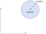

```c
b2Circle circle;
circle.center = (b2Vec2){2.0f, 3.0f};
circle.radius = 0.5f;
```

You can also initialize a circle and other structures inline. This is an equivalent circle:

```c
b2Circle circle = {{2.0f, 3.0f}, 0.5f};
```

### Capsules
Capsules have two center points and a radius. The center points are the centers of two
semicircles that are connected by a rectangle.

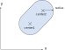

```c
b2Capsule capsule;
capsule.center1 = (b2Vec2){1.0f, 1.0f};
capsule.center1 = (b2Vec2){2.0f, 3.0f};
capsule.radius = 0.25f;
```

### Polygons
Box2D polygons are solid convex polygons. A polygon is convex when all
line segments connecting two points in the interior do not cross any
edge of the polygon. Polygons are solid and never hollow. A polygon must
have 3 or more vertices.


Polygons vertices are stored with a counter clockwise winding (CCW). We
must be careful because the notion of CCW is with respect to a
right-handed coordinate system with the z-axis pointing out of the
plane. This might turn out to be clockwise on your screen, depending on
your coordinate system conventions.

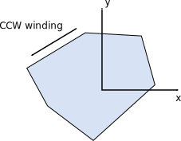

The polygon members are public, but you should use initialization
functions to create a polygon. The initialization functions create
normal vectors and perform validation.

Polygons in Box2D have a maximum of 8 vertices, as controlled by #b2_maxPolygonVertices.
If you have more complex shapes, I recommend to use multiple polygons.

There are a few ways to create polygons. You can attempt to create them manually,
but this is not recommend. Instead there are several functions provided to create them.

For example if you need a square or box you can use these functions:

```c
b2Polygon square = b2MakeSquare(0.5f);
b2Polygon box = b2MakeBox(0.5f, 1.0f);
```

The values provided to these functions are *extents*, which are half-widths or half-heights. This goes well
with circles and capsules using radii instead of diameters.

Box2D also supports rounded polygons. These are convex polygons with a thick rounded skin.

```c
b2Polygon roundedBox = b2MakeRoundedBox(0.5f, 1.0f, 0.25f);
```

If you want a box that is not centered on the body origin, you can use an offset box.

```c
b2Vec2 center = {1.0f, 0.0f};
float angle = b2_pi / 4.0f;
b2Polygon offsetBox = b2MakeOffsetBox(0.5f, 1.0f, center, angle);
```

If you want a more general convex polygon, you can compute the hull using `b2ComputeHull()`. Then you can
create a polygon from the hull. You can make this rounded or not.

```c
b2Vec2 points[] = {{-1.0f, 0.0f}, {1.0f, 0.0f}, {0.0f, 1.0f}};
b2Hull hull = b2ComputeHull(points, 3);
float radius = 0.1f;
b2Polygon roundedTriangle = b2MakePolygon(&hull, radius);
```

If you have an automatic process for generating convex polygons, you may feed a degenerate set of points to `b2ComputeHull()`. You should check that the hull was created successfully before creating the polygon or you will get an assertion.

```c
b2Hull questionableHull = b2ComputeHull(randomPoints, 8);
if (questionableHull.count == 0)
{
    // handle failure
}
```

### Segments
Segments are line segments. A major limitation of segment
shapes is that they can collide with circles, capsules, and polygons but not with
themselves. The collision algorithms used by Box2D require that at least
one of two colliding shapes has volume. Segment shapes have no volume, so
segment-segment collision is not possible.

```c
b2Segment segment1;
segment1.point1 = (b2Vec2){0.0f, 0.0f};
segment2.point2 = (b2Vec2){1.0f, 0.0f};

// equivalent
b2Segment segment2 = {{0.0f, 0.0f}, {1.0f, 0.0f}};
```

### Ghost Collisions
In many cases a game environment is constructed by connecting several
segment shapes end-to-end. This can give rise to an unexpected artifact
when a polygon slides along the chain of segment. In the figure below we
see a box colliding with an internal vertex. These *ghost* collisions
are caused when the polygon collides with an internal vertex generating
an internal collision normal.

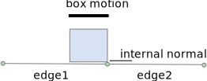{html: width=30%}

If edge1 did not exist this collision would seem fine. With edge1
present, the internal collision seems like a bug. But normally when
Box2D collides two shapes, it views them in isolation.

Fortunately, the smooth segment shape provides a mechanism for eliminating ghost
collisions by storing the adjacent *ghost* vertices. Box2D uses these
ghost vertices to prevent internal collisions.

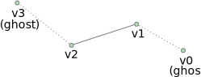{html: width=30%}

The Box2D algorithm for dealing with ghost collisions only supports
one-sided collision. The front face is to the right when looking from the first
vertex towards the second vertex. This matches the CCW winding order
used by polygons.

### Smooth segment

Smooth segments use a concept called *ghost vertices* that Box2D can use to eliminate ghost
collisions.

```c
b2SmoothSegment smoothSegment = {0};
smoothSegment.ghost1 = (b2Vec2){1.7f, 0.0f};
smoothSegment.segment = (b2Segment){{1.0f, 0.25f}, {0.0f, 0.0f}};
smoothSegment.ghost2 = (b2Vec2){-1.7f, 0.4f};
```

These ghost vertices must align with vertices of neighboring smooth segments, making them
tedious and error-prone to setup.

Normally you will have no need to create smooth segments directly. There are convenience functions
for creating chains of smooth segments on rigid bodies. See `b2ChainDef` and `b2CreateChain()`.

## Geometric Queries
You can perform a geometric queries on a single shape.

### Shape Point Test
You can test a point for overlap with a shape. You provide a transform
for the shape and a world point.

```c
b2Vec2 point = {5.0f, 2.0f};
bool hit = b2PointInCapsule(point, &myCapsule);
```

See also `b2PointInCircle()` and `b2PointInPolygon()`.

### Ray Cast
You can cast a ray at a shape to get the point of first intersection and normal vector.

> **Caution**:
> No hit will register if the ray starts inside a convex shape like a circle or polygon. This is consistent with Box2D treating convex shapes as solid. 

```c
b2RayCastInput input;
input.origin = (b2Vec2){0.0f, 0.0f};
input.translation = (b2Vec2){1.0f, 0.0f};
input.maxFraction = 1.0f;

b2CastOutput output = b2RayCastPolygon(&input, &myPolygon);
if (output.hit == true)
{
    // do something
}
```

### Shape Cast
You can also cast a shape at another shape. This uses an abstract way of describing the moving shape. It is represented as a point cloud with a radius. This implies a convex shape even if the input data is not convex. The internal algorithm (GJK) will essentially only use the convex portion.

```c
b2ShapeCastInput input;
input.points[0] = (b2Vec2){1.0f, 0.0f};
input.points[1] = (b2Vec2){2.0f, -3.0f};
input.radius = 0.2f;
input.translation = (b2Vec2){1.0f, 0.0f};
input.maxFraction = 1.0f;

b2CastOutput output = b2ShapeCastPolygon(&input, &myPolygon);
if (output.hit == true)
{
    // do something
}
```

### Contact Manifolds
Box2D has functions to compute contact points for overlapping shapes. If
we consider circle-circle or circle-polygon, we can only get one contact
point and normal. In the case of polygon-polygon we can get two points.
These points share the same normal vector so Box2D groups them into a
manifold structure. The contact solver takes advantage of this to
improve stacking stability.

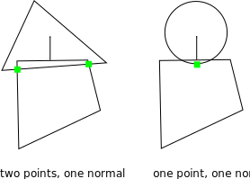

Normally you don't need to compute contact manifolds directly, however
you will likely use the results produced in the simulation.

The b2Manifold structure holds a normal vector and up to two contact
points. The normal and points are held in local coordinates. As a
convenience for the contact solver, each point stores the normal and
tangential (friction) impulses.

The data stored in `b2Manifold is optimized for internal use. If you need
this data, it is usually best to use the b2WorldManifold structure to
generate the world coordinates of the contact normal and points. You
need to provide a b2Manifold and the shape transforms and radii.

```cpp
b2WorldManifold worldManifold;
worldManifold.Initialize(&manifold, transformA, shapeA.m_radius,
transformB, shapeB.m_radius);

for (int32 i = 0; i < manifold.pointCount; ++i)
{
    b2Vec2 point = worldManifold.points[i];
    ...
}
```

Notice that the world manifold uses the point count from the original
manifold.

During simulation shapes may move and the manifolds may change. Points
may be added or removed. You can detect this using b2GetPointStates.

```cpp
b2PointState state1[2], state2[2];
b2GetPointStates(state1, state2, &manifold1, &manifold2);

if (state1[0] == b2_removeState)
{
    // process event
}
```

### Distance
The `b2Distance` function can be used to compute the distance between two
shapes. The distance function needs both shapes to be converted into a
b2DistanceProxy. There is also some caching used to warm start the
distance function for repeated calls.

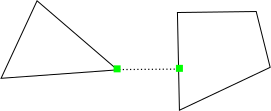{html: width=30%}

### Time of Impact
If two shapes are moving fast, they may *tunnel* through each other in a
single time step.

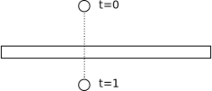{html: width=30%}

The `b2TimeOfImpact` function is used to determine the time when two
moving shapes collide. This is called the *time of impact* (TOI). The
main purpose of `b2TimeOfImpact` is for tunnel prevention. In particular,
it is designed to prevent moving objects from tunneling outside of
static level geometry.

This function accounts for rotation and translation of both shapes,
however if the rotations are large enough, then the function may miss a
collision. However the function will still report a non-overlapped time
and will capture all translational collisions.

The time of impact function identities an initial separating axis and
ensures the shapes do not cross on that axis. This might miss collisions
that are clear at the final positions. While this approach may miss some
collisions, it is very fast and adequate for tunnel prevention.

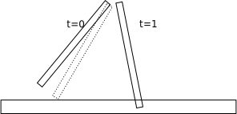{html: width=30%}

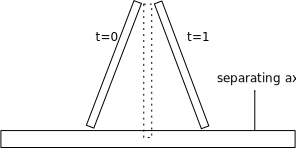{html: width=30%}

It is difficult to put a restriction on the rotation magnitude. There
may be cases where collisions are missed for small rotations. Normally,
these missed rotational collisions should not harm game play. They tend
to be glancing collisions.

The function requires two shapes (converted to b2DistanceProxy) and two
b2Sweep structures. The sweep structure defines the initial and final
transforms of the shapes.

You can use fixed rotations to perform a *shape cast*. In this case, the
time of impact function will not miss any collisions.

## Dynamic Tree
The b2DynamicTree class is used by Box2D to organize large numbers of
shapes efficiently. The class does not know about shapes. Instead it
operates on axis-aligned bounding boxes (AABBs) with user data pointers.

The dynamic tree is a hierarchical AABB tree. Each internal node in the
tree has two children. A leaf node is a single user AABB. The tree uses
rotations to keep the tree balanced, even in the case of degenerate
input.

The tree structure allows for efficient ray casts and region queries.
For example, you may have hundreds of shapes in your scene. You could
perform a ray cast against the scene in a brute force manner by ray
casting each shape. This would be inefficient because it does not take
advantage of shapes being spread out. Instead, you can maintain a
dynamic tree and perform ray casts against the tree. This traverses the
ray through the tree skipping large numbers of shapes.

A region query uses the tree to find all leaf AABBs that overlap a query
AABB. This is faster than a brute force approach because many shapes can
be skipped.

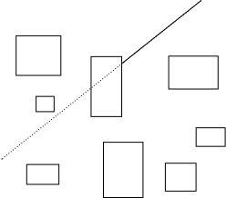{html: width=30%}

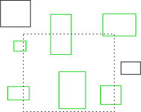{html: width=30%}

Normally you will not use the dynamic tree directly. Rather you will go
through the b2World class for ray casts and region queries. If you plan
to instantiate your own dynamic tree, you can learn how to use it by
looking at how Box2D uses it.

## Broad-phase
Collision processing in a physics step can be divided into narrow-phase
and broad-phase. In the narrow-phase we compute contact points between
pairs of shapes. Imagine we have N shapes. Using brute force, we would
need to perform the narrow-phase for N*N/2 pairs.

The b2BroadPhase class reduces this load by using a dynamic tree for
pair management. This greatly reduces the number of narrow-phase calls.

Normally you do not interact with the broad-phase directly. Instead,
Box2D creates and manages a broad-phase internally. Also, b2BroadPhase
is designed with Box2D's simulation loop in mind, so it is likely not
suited for other use cases.
