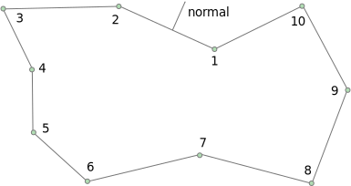
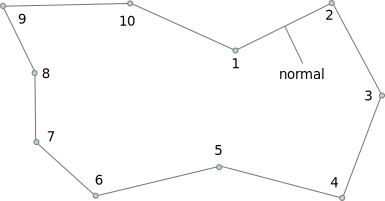
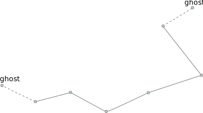
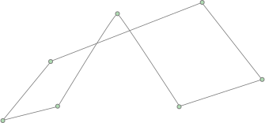
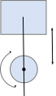

# Simulation
Rigid body simulation is the primary feature of Box2D. It is the most complex part of
Box2D and is the part you likely interact with the most. Simulations sits on top of
the base and collision functions, so you should be somewhat familiar
with those by now.

Rigid body simulation contains:
- worlds
- bodies
- shapes
- contacts
- joints
- events

There are many dependencies between these objects so it is difficult to
describe one without referring to another. In the following, you
may see some references to objects that have not been described yet.
Therefore, you may want to quickly skim this section before reading it
closely.

## Handles (Ids)
Box2D has a C interface. Typically in a C/C++ library when you create an object with a long lifetime
you will keep a pointer (or smart pointer) to the object.

Box2D works differently. Instead of pointers, you are given an *id* when you create an object.
This *id* acts as a [handle](https://en.wikipedia.org/wiki/Handle_(computing)) and help avoid
problems with [dangling pointers](https://en.wikipedia.org/wiki/Dangling_pointer).

So you will be dealing with `b2WorldId`, `b2BodyId`, etc. These are small opaque structures that you
will pass around by value, just like pointer. Box2D creation functions return an id. Functions
that operate on Box2D objects take ids.

```c
b2BodyId myBodyId = b2CreateBody(myWorldId, &myBodyDefintion);
```

There are functions to check if an id is valid. Box2D functions will assert if you use an invalid id.
This makes debugging easier than using dangling pointers.

```c
if (b2Body_IsValid(myBodyId) == false)
{
    // oops
}
```

## World
The Box2D world contains the bodies and joints. It manages all aspects
of the simulation and allows for asynchronous queries (like AABB queries
and ray-casts). Much of your interactions with Box2D will be with a
world object, using `b2WorldId`.

### World Definition
Worlds are created using a *definition* structure. This is temporary structure that
you can use to configure options for world creation. You **must** initialize the world definition
using `b2DefaultWorldDef()`.

```c
b2WorldDef worldDef = b2DefaultWorldDef();
```

The world definition has lots of options, but for most you will use the defaults. You may want to set the gravity:

```c
worldDef.gravity = (b2Vec2){0.0f, -10.0f};
```

If your game doesn't need sleep, you can get a performance boost by completely disabling sleep:

```c
worldDef.enableSleep = false;
```

You can also configure multithreading to improve performance:

```c
worldDef.workerCount = 4;
worldDef.enqueueTask = myAddTaskFunction;
worldDef.finishTask = myFinishTaskFunction;
worldDef.userTaskContext = &myTaskSystem;
```

Multithreading is not required but it can improve performance substantially. Read more [here](#multi).

### Creating and Destroying a World
Creating a world is done using a world definition.

```c
b2WorldId myWorldId = b2CreateWorld(&worldDef);

// ... do stuff ...

b2DestroyWorld(myWorldId);

// Nullify id for safety
myWorldId = b2_nullWorldId;
```

You can create up to 128 worlds. These worlds do not interact and may be simulated in parallel.

When you destroy a world, every body, shape, and joint is also destroyed. This is much faster
than destroying individual objects.

### Using a World
The world is used for creating and destroying bodies
and joints. These interfaces are discussed later in the sections on
bodies and joints. There are some other interactions with Box2D worlds that I
will cover now.

### Simulation
The world is used to drive the simulation. You specify a time step
and a velocity and position iteration count. For example:

```c
float timeStep = 1.0f / 60.f;
int32_t subSteps = 10;
b2World_Step(myWorldId, timeStep, subSteps);
```

After the time step you can examine your bodies and joints for
information. Most likely you will grab the position off the bodies so
that you can update your actors and render them. You can perform the
time step anywhere in your game loop, but you should be aware of the
order of things. For example, you must create bodies before the time
step if you want to get collision results for the new bodies in that
frame.

As I discussed above in the HelloWorld tutorial, you should use a fixed
time step. By using a larger time step you can improve performance in
low frame rate scenarios. But generally you should use a time step no
larger than 1/30 seconds (30Hz). A time step of 1/60 seconds (60Hz) will usually
deliver a high quality simulation.

The sub-step count is used to increase accuracy. By sub-stepping the solver
divides up time into small increments and the bodies move by a small amount.
This allows joints and contacts to respond with finer detail. The recommended
sub-step count is 4. However, increasing the sub-step count may improve 
accuracy. For example, long joint chains will stretch less with more sub-steps.

The scissor lift sample shown [here](#samples) works better with more sub-steps
and is configured to use 8 sub-steps. With a primary time step of 1/60 seconds,
the scissor lift is taking sub-steps of 1/480 seconds!

## Rigid Bodies
Rigid bodies, or just *bodies* have position and velocity. You can apply forces, torques,
and impulses to bodies. Bodies can be static, kinematic, or dynamic. Here
are the body type definitions:

### Body types
#b2_staticBody:
A static body does not move under simulation and behaves as if it has infinite mass.
Internally, Box2D stores zero for the mass and the inverse mass. A static body has zero
velocity. Static bodies do not collide with other static or kinematic bodies.

#b2_kinematicBody:
A kinematic body moves under simulation according to its velocity.
Kinematic bodies do not respond to forces. A kinematic body is moved by setting its
velocity. A kinematic body behaves as if it has infinite mass, however,
Box2D stores zero for the mass and the inverse mass. Kinematic bodies do
not collide with other kinematic or static bodies. Generally you should use
a kinematic body if you want a shape to be animated and not affected by
forces or collisions.

#b2_dynamicBody:
A dynamic body is fully simulated and move according to forces. A dynamic body can
collide with all body types. A dynamic body always has finite, non-zero
mass. If you try to set the mass of a dynamic body to zero, it will
automatically acquire a mass of one kilogram and it won't rotate.

> **Caution**:
> Generally you should not set the transform on bodies after creation.
> Box2D treats this as a teleport and may result in undesirable behavior.

Bodies carry shapes and move them around in the world. Bodies are always
rigid bodies in Box2D. That means that two shapes attached to the same rigid body never move
relative to each other and shapes attached to the same body don't
collide.

Shapes have collision geometry and density. Normally, bodies acquire
their mass properties from the shapes. However, you can override the
mass properties after a body is constructed.

You usually keep ids to all the bodies you create. This way you can
query the body positions to update the positions of your graphical
entities. You should also keep body ids so you can destroy them
when you are done with them.

### Body Definition
Before a body is created you must create a body definition (b2BodyDef).
The body definition holds the data needed to create and initialize a
body correctly.

Because Box2D uses a C API, a function is provided to create a valid
body definition.

```c
b2BodyDef myBodyDef = b2DefaultBodyDef();
```

This ensures the body definition is valid and this initialization is **mandatory**.

Box2D copies the data out of the body definition; it does not keep a
pointer to the body definition. This means you can recycle a body
definition to create multiple bodies.

Let's go over some of the key members of the body definition.

### Body Type
As discussed previously, there are three different
body types: static, kinematic, and dynamic. b2_staticBody is the default.
You should establish the body type at creation because changing the body type
later is expensive.

```c
b2BodyDef bodyDef;
bodyDef.type = b2_dynamicBody;
```

### Position and Angle
The body definition gives you the chance to initialize the position and rotation of
the body on creation. This has far better performance than creating the body at the
world origin and then moving the body.

> **Caution**:
> Do not create a body at the origin and then move it. If you create
> several bodies at the origin, then performance will suffer.

A body has two main points of interest. The first point is the body's
origin. Shapes and joints are attached relative to the body's origin.
The second point of interest is the center of mass. The center of mass
is determined from the mass distribution of the attached shapes or is
explicitly set with b2MassData. Much of Box2D's internal computations
use the center of mass position. For example the body stores the linear
velocity for the center of mass, not the body origin.

When you are building the body definition, you may not know where the
center of mass is located. Therefore you specify the position of the
body's origin. You may also specify the body's angle in radians, which
is not affected by the position of the center of mass. If you later
change the mass properties of the body, then the center of mass may move
on the body, but the origin position does not change and the attached
shapes and joints do not move.

```c
b2BodyDef bodyDef = b2DefaultBodyDef();
bodyDef.position = (b2Vec2){0.0f, 2.0f}; // the body origin
bodyDef.angle = 0.25f * b2_pi; // the body rotation in radians.
```

A rigid body is a frame of reference. You can define shapes and
joints in that frame. Those shapes and joint anchors never move in the
local frame of the body.

### Damping
Damping is used to reduce the world velocity of bodies. Damping is
different than friction because friction only occurs with contact.
Damping is not a replacement for friction and the two effects are
used together.

Damping parameters should be between 0 and infinity, with 0 meaning no
damping, and infinity meaning full damping. Normally you will use a
damping value between 0 and 0.1. I generally do not use linear damping
because it makes bodies look like they are floating.

```c
bodyDef.linearDamping = 0.0f;
bodyDef.angularDamping = 0.01f;
```

Damping is approximated to improve performance. At small damping
values the damping effect is mostly independent of the time step. At
larger damping values, the damping effect will vary with the time step.
This is not an issue if you use a fixed time step (recommended).

Here's some math for the curious. A first-order different equation for velocity damping is:

\f[
\frac{dv}{dt} + c v = 0
\f]

The solution with initial velocity \f$v_0\f$ is
\f[
v = v_0 e^{-c t}
\f]

Across a single time step \f$h\f$ the velocity evolves like so
\f[
v(t + h) = v_0 e^{-c (t + h)} = v_0 e^{-c t} e^{-c h} = v(t) e^{-c h}
\f]

Using the [Pade approximation](https://en.wikipedia.org/wiki/Pad%C3%A9_table)
\f[
v(t + h) \approx \frac{1}{1 + c h} v(t)
\f]

This is the formula used in the Box2D solver.

### Gravity Scale
You can use the gravity scale to adjust the gravity on a single body. Be
careful though, a large gravity magnitude can decrease stability.

```c
// Set the gravity scale to zero so this body will float
bodyDef.gravityScale = 0.0f;
```

### Sleep Parameters
What does sleep mean? Well it is expensive to simulate bodies, so the
less we have to simulate the better. When a body comes to rest we would
like to stop simulating it.

When Box2D determines that a body (or group of bodies) has come to rest,
the body enters a sleep state which has very little CPU overhead. If a
body is awake and collides with a sleeping body, then the sleeping body
wakes up. Bodies will also wake up if a joint or contact attached to
them is destroyed. You can also wake a body manually.

The body definition lets you specify whether a body can sleep and
whether a body is created sleeping.

```c
bodyDef.enableSleep = true;
bodyDef.isAwake = true;
```

### Fixed Rotation
You may want a rigid body, such as a character, to have a fixed
rotation. Such a body should not rotate, even under load. You can use
the fixed rotation setting to achieve this:

```c
bodyDef.fixedRotation = true;
```

The fixed rotation flag causes the rotational inertia and its inverse to
be set to zero.

### Bullets
Game simulation usually generates a sequence of transorms that are played
at some frame rate. This is called discrete simulation. In discrete
simulation, rigid bodies can move by a large amount in one time step. If
a physics engine doesn't account for the large motion, you may see some
objects incorrectly pass through each other. This effect is called
tunneling.

By default, Box2D uses continuous collision detection (CCD) to prevent
dynamic bodies from tunneling through static bodies. This is done by
sweeping shapes from their old position to their new positions. The
engine looks for new collisions during the sweep and computes the time
of impact (TOI) for these collisions. Bodies are moved to their first
TOI at the end of the time step.

Normally CCD is not used between dynamic bodies. This is done to keep
performance reasonable. In some game scenarios you need dynamic bodies
to use CCD. For example, you may want to shoot a high speed bullet at a
stack of dynamic bricks. Without CCD, the bullet might tunnel through
the bricks.

Fast moving objects in Box2D can be configured as *bullets*. Bullets will
perform CCD with all body types, but not other bullets. You should decide what
bodies should be bullets based on your game design. If you decide a body
should be treated as a bullet, use the following setting.

```c
bodyDef.isBullet = true;
```

The bullet flag only affects dynamic bodies.

### Disabling
You may wish a body to be created but not participate in collision or
simulation. This state is similar to sleeping except the body will not be
woken by other bodies and the body's shapes will not collide with anything.
This means the body will not participate in collisions, ray
casts, etc.

You can create a body as disabled and later enable it.

```c
bodyDef.isEnabled = false;
```

Joints may be connected to disabled bodies. These joints will not be
simulated. You should be careful when you enable a body that its
joints are not distorted.

Note that enabling a body is almost as expensive as creating the body
from scratch. So you should not use body disabling for streaming worlds. Instead, use
creation/destruction for streaming worlds to save memory.

### User Data
User data is a void pointer. This gives you a hook to link your
application objects to bodies. You should be consistent to use the same
object type for all body user data.

```c
bodyDef.userData = &myGameObject;
```

This is most often when you receive results from a query such as a ray-cast
or event and you want to get back to your game object.

### Body Creation
Bodies are created and destroyed using a world id. This lets the world create
the body with an efficient allocator and add the body to the world data structure.

```c
b2BodyId myBodyId = b2CreateBody(myWorldId, &bodyDef);

// ... do stuff ...

b2DestroyBody(myBodyId);

// Nullify body id for safety
myBodyId = b2_nullBodyId;
```

Box2D does not keep a reference to the body definition or any of the
data it holds (except user data pointers). So you can create temporary
body definitions and reuse the same body definitions.

Box2D allows you to avoid destroying bodies by destroying the world
directly using `b2DestroyWorld()`, which does all the cleanup work for you.
However, you should be mindful to nullify body ids that you keep in your application.

When you destroy a body, the attached shapes and joints are
automatically destroyed. This has important implications for how you
manage shape and joint ids. You should nullify these ids after destroying
a body.

### Using a Body
After creating a body, there are many operations you can perform on the
body. These include setting mass properties, accessing position and
velocity, applying forces, and transforming points and vectors.

### Mass Data
A body has mass (scalar), center of mass (2-vector), and rotational
inertia (scalar). For static bodies, the mass and rotational inertia are
set to zero. When a body has fixed rotation, its rotational inertia is
zero.

Normally the mass properties of a body are established automatically
when shapes are added to the body. You can also adjust the mass of a
body at run-time. This is usually done when you have special game
scenarios that require altering the mass.

```c
b2MassData myMassData;
myMassData.mass = 10.0f;
myMassData.center = (b2Vec2){0.0f, 0.0f};
myMassData.I = 100.0f;
b2Body_SetMassData(myBodyId, &myMassData);
```

After setting a body's mass directly, you may wish to revert to the
natural mass dictated by the shapes. You can do this with:

```c
b2Body_ApplyMassFromShapes(myBodyId);
```

The body's mass data is available through the following functions:

```c
float mass = b2Body_GetMass(myBodyId);
float inertia = b2Body_GetInertiaTensor(myBodyId);
b2Vec2 localCenter b2Body_GetLocalCenterOfMass(myBodyId);
b2MassData massData = b2Body_GetMassData(myBodyId);
```

### State Information
There are many aspects to the body's state. You can access this state
data efficiently through the following functions:

```c
b2Body_SetType(myBodyId, b2_kinematicBody);
b2BodyType bodyType = b2Body_GetType(myBodyId);
b2Body_SetBullet(myBodyId, true);
bool isBullet = b2Body_IsBullet(myBodyId);
b2Body_EnableSleep(myBodyId, false);
bool isSleepEnabled = b2Body_IsSleepingEnabled(mybodyId);
b2Body_SetAwake(myBodyId, true);
bool isAwake = b2Body_IsAwake(myBodyId);
b2Body_Disable(myBodyId);
bool isEnabled = b2Body_IsEnabled(myBodyId);
b2Body_SetFixedRotation(myBodyId, true);
bool isFixedRotation = b2Body_IsFixedRotation(myBodyId);
```

Please see the comments on these functions for more details.

### Position and Velocity
You can access the position and rotation of a body. This is common when
rendering your associated game actor. You can also set the position and rotation,
although this is less common since you will normally use Box2D to
simulate movement.

Keep in mind that the Box2D interface uses *radians*.

```c
b2Body_SetTransform(myBodyId, position, angleInRadians);
b2Transform transform = b2Body_GetTransform(myBodyId);
b2Vec2 position = b2Body_GetPosition(myBodyId);
b2Rot rotation = b2Body_GetRotation(myBodyId);
float angleInRadians = b2Body_GetAngle(myBodyId);
```

You can access the center of mass position in local and world
coordinates. Much of the internal simulation in Box2D uses the center of
mass. However, you should normally not need to access it. Instead you
will usually work with the body transform. For example, you may have a
body that is square. The body origin might be a corner of the square,
while the center of mass is located at the center of the square.

```c
b2Vec2 worldCenter = b2Body_GetWorldCenterOfMass(myBodyId);
b2Vec2 localCenter = b2Body_GetLocalCenterOfMass(myBodyId);
```

You can access the linear and angular velocity. The linear velocity is
for the center of mass. Therefore, the linear velocity may change if the
mass properties change. Since Box2D uses radians, the angular velocity is
in radians per second.

```c
b2Vec2 linearVelocity = b2Body_GetLinearVelocity(myBodyId);
float angularVelocity = b2Body_GetAngularVelocity(myBodyId);
```

### Forces and Impulses
You can apply forces, torques, and impulses to a body. When you apply a
force or an impulse, you can provide a world point where the load is
applied. This often results in a torque about the center of mass.

```c
b2Body_ApplyForce(myBodyId, force, worldPoint, wake);
b2Body_ApplyTorque(myBodyId, torque, wake);
b2Body_ApplyLinearImpulse(myBodyId, linearImpulse, worldPoint, wake);
b2Body_ApplyAngularImpulse(myBodyId, angularImpulse, wake);
```

Applying a force, torque, or impulse optionally wakes the body. If you don't
wake the body and it is asleep, the force or impulse will be ignored.

You can also apply a force and linear impulse to the center of mass to avoid rotation.

```c
b2Body_ApplyForceToCenter(myBodyId, force, wake);
b2Body_ApplyLinearImpulseToCenter(myBodyId, linearImpulse, wake);
```

> **Caution**:
> Since Box2D uses sub-stepping, you should not apply a steady impulse
> for several frames. Instead you should apply a force which Box2D will
> spread out evenly across the sub-steps, resulting in smoother movement.

### Coordinate Transformations
The body has some utility functions to help you transform points
and vectors between local and world space. If you don't understand
these concepts, please read \"Essential Mathematics for Games and
Interactive Applications\" by Jim Van Verth and Lars Bishop.

```c
b2Vec2 worldPoint = b2Body_GetWorldPoint(myBodyId, localPoint);
b2Vec2 worldVector = b2Body_GetWorldVector(myBodyId, localVector);
b2Vec2 localPoint = b2Body_GetLocalPoint(myBodyId, worldPoint);
b2Vec2 localVector = b2Body_GetLocalVector(myBodyId, worldVector);
```

### Acessing Shapes and Joints
You can access the shapes on a body. You can get the number of shapes first.

```c
int shapeCount = b2Body_GetShapeCount(myBodyId);
```

If you have bodies with many shapes, you can allocate an array now or if you
know the number is limited you can use a fixed size array.

```c
b2ShapeId shapeIds[10];
int returnCount = b2Body_GetShapes(myBodyId, shapeIds, 10);

for (int i = 0; i < returnCount; ++i)
{
    b2ShapeId shapeId = shapeIds[i];

    // do something with shapeId
}
```

You can similarly get an array of the joints on a body.

## Shapes
A body may have zero or more shapes. A body with multiple shapes is sometimes
called a *compound body.*

Shapes hold the following:
- a single shape primitive
- density, friction, and restitution
- collision filtering flags
- parent body id
- user data
- sensor flag

These are described in the following sections.

### Shape Creation
Shapes are created by initializing a shape definition and a shape primitive.
These are passed to a creation function specific to each shape type.

```c
b2ShapeDef shapeDef = b2DefaultShapeDef();
shapeDef.density = 10.0f;
shapeDef.friction = 0.7f;

b2Polygon box = b2MakeBox(0.5f, 1.0f);
b2ShapeId myShapeId = b2CreatePolygonShape(myBodyId, &shapeDef, &box);
```

This creates the shape and attaches it to the body. You do not need to
store the shape id since the shape will automatically be
destroyed when the parent body is destroyed. You can create multiple
shapes on a single body. However, you may wish to store the shape id if you plan
to change properties on it later.

You can destroy a shape on the parent body. You may do this to model a
breakable object. Otherwise you can just leave the shape alone and let
the body destruction take care of destroying the attached shapes.

```c
b2DestroyShape(myShapeId);
```

Material properties such as density, friction, and restitution are associated with shapes
instead of bodies. Since you can attach multiple shapes to a body, this allows for more
possible setups. For example, you can make a car that is heavier in the back.

### Density
The shape density is used to compute the mass properties of the parent
body. The density can be zero or positive. You should generally use
similar densities for all your shapes. This will improve stacking
stability.

The mass of a body is not adjusted when you set the density. You must
call `b2Body_ApplyMassFromShapes()` for this to occur. Generally you should establish
the shape density in `b2ShapeDef` and avoid modifying it later because this
can be expensive, especially on a compound body.

```c
b2Shape_SetDensity(myShapeId, 5.0f);
b2Body_ApplyMassFromShapes(myBodyId);
```

### Friction
Friction is used to make objects slide along each other realistically.
Box2D supports static and dynamic friction, but uses the same parameter
for both. Box2D attempts to simulation friction accurately and the friction
strength is proportional to the normal force. This is called [Coulomb
friction](https://en.wikipedia.org/wiki/Friction). The friction parameter
is usually set between 0 and 1, but
can be any non-negative value. A friction value of 0 turns off friction
and a value of 1 makes the friction strong. When the friction force is
computed between two shapes, Box2D must combine the friction parameters
of the two parent shapes. This is done with the geometric mean:

```c
float mixedFriction = sqrtf(b2Shape_GetFriction(shapeIdA) * b2Shape_GetFriction(shapeIdB));
```

If one shape has zero friction then the mixed friction will be zero.

### Restitution
[Restitution](https://en.wikipedia.org/wiki/Coefficient_of_restitution) is used to make
objects bounce. The restitution value is
usually set to be between 0 and 1. Consider dropping a ball on a table.
A value of zero means the ball won't bounce. This is called an
*inelastic* collision. A value of one means the ball's velocity will be
exactly reflected. This is called a *perfectly elastic* collision.
Restitution is combined using the following formula.

```c
float mixedRestitution = sqrtf(b2Shape_GetRestitution(shapeIdA) * b2Shape_GetRestitution(shapeIdB));
```

Restitution is combined this way so that you can have a bouncy super
ball without having a bouncy floor.

When a shape develops multiple contacts, restitution is simulated
approximately. This is because Box2D uses an sequential solver. Box2D
also uses inelastic collisions when the collision velocity is small.
This is done to prevent jitter. See `b2WorldDef::restitutionThreshold`.

### Filtering
Collision filtering allows you to efficiently prevent collision between shapes.
For example, say you make a character that rides a bicycle. You want the
bicycle to collide with the terrain and the character to collide with
the terrain, but you don't want the character to collide with the
bicycle (because they must overlap). Box2D supports such collision
filtering using categories and groups.

Box2D supports 32 collision categories. For each shape you can specify
which category it belongs to. You also specify what other categories
this shape can collide with. For example, you could specify in a
multiplayer game that all players don't collide with each other and
monsters don't collide with each other, but players and monsters should
collide. This is done with masking bits. For example:

```c
b2ShapeDef playerShapeDef = b2DefaultShapeDef();
b2ShapeDef monsterShapeDef = b2DefaultShapeDef();
playerShapeDef.filter.categoryBits = 0x00000002;
monsterShapeDef.filter.categoryBits = 0x00000004;
playerShapeDef.filter.maskBits = 0x00000004;
monsterShapeDef.filter.maskBits = 0x00000002;
```

Here is the rule for a collision to occur:

```c
uint32_t catA = shapeA.filter.categoryBits;
uint32_t maskA = shapeA.filter.maskBits;
uint32_t catB = shapeB.filter.categoryBits;
uint32_t maskB = shapeB.filter.maskBits;

if ((catA & maskB) != 0 && (catB & maskA) != 0)
{
    // shapes can collide
}
```

Collision groups let you specify an integral group index. You can have
all shapes with the same group index always collide (positive index)
or never collide (negative index). Group indices are usually used for
things that are somehow related, like the parts of a bicycle. In the
following example, shape1 and shape2 always collide, but shape3
and shape4 never collide.

```c
shape1Def.filter.groupIndex = 2;
shape2Def.filter.groupIndex = 2;
shape3Def.filter.groupIndex = -8;
shape4Def.filter.groupIndex = -8;
```

Collisions between shapes of different group indices are filtered
according the category and mask bits. In other words, group filtering
has higher precedence than category filtering.

Note that additional collision filtering occurs in Box2D. Here is a
list:
- A shape on a static body can only collide with a dynamic body.
- A shape on a kinematic body can only collide with a dynamic body.
- Shapes on the same body never collide with each other.
- You can optionally enable/disable collision between shapes on bodies connected by a joint.

Sometimes you might need to change collision filtering after a shape
has already been created. You can get and set the `b2Filter` structure on
an existing shape using `b2Shape_GetFilter()` and
`b2Shape_SetFilter()`. Note that changing the filter is expensive because
it causes contacts to be destroyed.

### Chain Shapes
The chain shape provides an efficient way to connect many line segments together
to construct your static game worlds. Chain shapes automatically
eliminate ghost collisions and provide one-sided collision.

If you don't care about ghost collisions, you can just create a bunch of
two-sided segment shapes. The performance is similar.

The simplest way to use chain shapes is to create loops. Simply provide an
array of vertices.

```c
b2Vec2 points[4] = {
    {1.7f, 0.0f},
    {1.0f, 0.25f},
    {0.0f, 0.0f},
    {-1.7f, 0.4f}};

b2ChainDef chainDef = b2DefaultChainDef();
chainDef.points = points;
chainDef.count = 4;

b2ChainId myChainId = b2CreateChain(myBodyId, &chainDef);

// Later ...
b2DestroyChain(myChainId);

// Nullify id for safety
myChainId = b2_nullChainId;
```

The segment normal depends on the winding order. A counter-clockwise winding order orients the normal outwards and a clockwise winding order orients the normal inwards.





You may have a scrolling game world and would like to connect several chains together.
You can connect chains together using ghost vertices. To do this you must have the first three or last three points
of each chain overlap. See the sample `ChainLink` for details.



Self-intersection of chain shapes is not supported. It might work, it
might not. The code that prevents ghost collisions assumes there are no
self-intersections of the chain. Also, very close vertices can cause
problems. Make sure all your points are more than than about a centimeter apart.

{html: width=30%}

Each segment in the chain is created as a `b2SmoothSegment` shape on the body. If you have the
shape id for a smooth segment shape, you can get the owning chain id. This will return `b2_nullChainId`
if the shape is not a smooth segment.

```c
b2ChainId chainId = b2SHape_GetParentChain(myShapeId);
```

### Sensors
Sometimes game logic needs to know when two shapes overlap yet there
should be no collision response. This is done by using sensors. A sensor
is a shape that detects collision but does not produce a response.

You can flag any shape as being a sensor. Sensors may be static,
kinematic, or dynamic. Remember that you may have multiple shapes per
body and you can have any mix of sensors and solid shapes. Also,
sensors only form contacts when at least one body is dynamic, so you
will not get sensors overlap detection for kinematic versus kinematic,
kinematic versus static, or static versus static. Finally sensors do not
detect other sensors. 

Sensor overlap detection is achieved using events, which are described
below.


## Contacts
Contacts internal objects created by Box2D to manage collision between pairs of
shapes. They are fundamental to rigid body simulation in games.

### Terminology
Contacts have a fair bit of terminology that are important to review.

#### contact point
A contact point is a point where two shapes touch. Box2D approximates
contact with a small number of points. Specifically, contact between
two shapes has 0, 1, or 2 points. This is possible because Box2D uses
convex shapes.

#### contact normal
A contact normal is a unit vector that points from one shape to another.
By convention, the normal points from shapeA to shapeB.

#### contact separation
Separation is the opposite of penetration. Separation is negative when
shapes overlap.

#### contact manifold
Contact between two convex polygons may generate up to 2 contact points.
Both of these points use the same normal, so they are grouped into a
contact manifold, which is an approximation of a continuous region of
contact.

#### normal impulse
The normal force is the force applied at a contact point to prevent the
shapes from penetrating. For convenience, Box2D uses impulses. The
normal impulse is just the normal force multiplied by the time step. Since
Box2D uses sub-stepping, this is the sub-step time step.

#### tangent impulse
The tangent force is generated at a contact point to simulate friction.
For convenience, this is stored as an impulse.

#### contact point id
Box2D tries to re-use the contact impulse results from a time step as the
initial guess for the next time step. Box2D uses contact point ids to match
contact points across time steps. The ids contain geometric features
indices that help to distinguish one contact point from another.

#### speculative contact
When two shapes are close together, Box2D will create up to two contact
points even if the shapes are not touching. This lets Box2D anticipate
collision to improve behavior. Speculative contact points have positive
separation.

### Contact Lifetime
Contacts are created when two shape's AABBs overlap. Sometimes
collision filtering will prevent the creation of contacts. Contacts are
destroyed with the AABBs cease to overlap.

So you might gather that there may be contacts created for shapes that
are not touching (just their AABBs). Well, this is correct. It's a
\"chicken or egg\" problem. We don't know if we need a contact object
until one is created to analyze the collision. We could delete the
contact right away if the shapes are not touching, or we can just wait
until the AABBs stop overlapping. Box2D takes the latter approach
because it lets the system cache information to improve performance.

### Contact Data
As mentioned before, the contact is created and destroyed by
Box2D. Contact data is not created by the user. However, you are
able to access the contact data.

You can get contact data from shapes or bodies. The contact data
on a shape is a sub-set of the contact data on a body. The contact
data is only returned for touching contacts. Contacts that are not
touching provide no meaningful information for an application.

Contact data is returned in arrays. So first you can ask a shape or
body how much space you'll need in your array. This number is conservative
and the actual number of contacts you'll receive may be less than
this number, but never more.

```c
int shapeContactCapacity = b2Shape_GetContactCapacity(myShapeId);
int bodyContactCapacity = b2Body_GetContactCapacity(myBodyId);
```

Now you can access the contact data. You could allocate array space to
get all the contact data in all cases, or you could use a fixed size
array and get a limited number of results.

```c
b2ContactData contactData[10];
int shapeContactCount = b2Shape_GetContactData(myShapeId, contactData, 10);
int bodyContactCount = b2Body_GetContactData(myBodyId, contactData, 10);
```

The contact data contacts the two shape ids and the manifold.

```c
for (int i = 0; i < bodyContactCount; ++i)
{
    b2ContactData* data = contactData + i;
    printf("point count = %d\n", data->manifold.pointCount);
}
```

Getting contact data off shapes and bodies is not the most efficient
way to handle contact data. Instead you should use contact events.

### Sensor Events
Sensor events are available after every call to `b2World_Step()`.
Sensor events are the best way to get information about sensors overlaps. There are
events for when a shape begins to overlap with a sensor.

```c
b2SensorEvents sensorEvents = b2World_GetSensorEvents(myWorldId);
for (int i = 0; i < sensorEvents.beginCount; ++i)
{
    b2SensorBeginTouchEvent* beginTouch = sensorEvents.beginEvents + i;
    void* myUserData = b2Shape_GetUserData(beginTouch->visitorShapeId);
    // process begin event
}
```

And there are events when a shape stops overlapping with a sensor.

```c
for (int i = 0; i < sensorEvents.endCount; ++i)
{
    b2SensorEndTouchEvent* endTouch = sensorEvents.endEvents + i;
    void* myUserData = b2Shape_GetUserData(endTouch->visitorShapeId);
    // process end event
}
```

You will not get end events if a shape is destroyed. Sensor events should
be processed after the world step and before other game logic. This should
help you avoid processing stale data.

Sensor events are only enabled for a non-sensor shape if `b2ShapeDef::enableSensorEvents`
is true.

### Contact Events
Contact events are available after each world step. Like sensor events these should be
retrieved and processed before performing other game logic. Otherwise
you may be accessing orphaned/invalid data.

You can access all contact events in a single data structure. This is much more efficient
than using functions like `b2Body_GetContactData()`.

```c
b2ContactEvents contactEvents = b2World_GetContactEvents(myWorldId);
```

None of this data applies to sensors. All events involve at least on dynamic body.

Hit events are generate

#### Contact Touch Event
`b2ContactBeginTouchEvent` is recorded when two shapes begin touching. These only
contain the two shape ids.

```c
for (int i = 0; i < contactEvents.beginCount; ++i)
{
    b2ContactBeginTouchEvent* beginEvent = contactEvents.beginEvents + i;
    // do stuff
}
```

`b2ContactEndTouchEvent` is recorded when two shapes stop touching. These only
contain the two shape ids.

```c
for (int i = 0; i < contactEvents.endCount; ++i)
{
    b2ContactEndTouchEvent* endEvent = contactEvents.endEvents + i;
    // do stuff
}
```

The end touch events are not generate when you destroy a shape or the body that owns it.

Shapes only generate begin and end touch events if `b2ShapeDef::enableContactEvents` is true.

#### Hit Events
Typically in games you are mainly concerned about getting contact events for when
two shapes collide at a high speed so you can play a sound and/or particle effect. Hit
events are the answer for this.

```c
for (int i = 0; i < contactEvents.hitCount; ++i)
{
    b2ContactHitEvent* hitEvent = contactEvents.hitEvents + i;
    if (hitEvent->approachSpeed > 10.0f)
    {
        // play sound
    }
}
```

Shapes only generate hit events if `b2ShapeDef::enableHitEvents` is true.

### Contact Filtering
Often in a game you don't want all objects to collide. For example, you
may want to create a door that only certain characters can pass through.
This is called contact filtering, because some interactions are filtered
out.

Box2D allows you to achieve custom contact filtering by implementing a
b2ContactFilter. This requires you to implement a
ShouldCollide function that receives two b2Shape pointers. Your function
returns true if the shapes should collide.

The default implementation of ShouldCollide uses the b2FilterData
defined in Chapter 6, Shapes.

```c
bool b2ContactFilter::ShouldCollide(b2Shape* shapeA, b2Shape* shapeB)
{
    const b2Filter& filterA = shapeA->GetFilterData();
    const b2Filter& filterB = shapeB->GetFilterData();

    if (filterA.groupIndex == filterB.groupIndex && filterA.groupIndex != 0)
    {
        return filterA.groupIndex > 0;
    }

    bool collideA = (filterA.maskBits & filterB.categoryBits) != 0;
    bool collideB = (filterA.categoryBits & filterB.maskBits) != 0
    bool collide =  collideA && collideB;
    return collide;
}
```

At run-time you can create an instance of your contact filter and
register it with b2World::SetContactFilter. Make sure your filter stays
in scope while the world exists.

```c
MyContactFilter filter;
world->SetContactFilter(&filter);
// filter remains in scope ...
```

### Advanced Contact Handling

#### Custom Filtering

#### Pre-Solve Callback
This is called after collision detection, but before collision
resolution. This gives you a chance to disable the contact based on the
current configuration. For example, you can implement a one-sided
platform using this callback and calling b2Contact::SetEnabled(false).
The contact will be re-enabled each time through collision processing,
so you will need to disable the contact every time-step. The pre-solve
event may be fired multiple times per time step per contact due to
continuous collision detection.

```c
void PreSolve(b2Contact* contact, const b2Manifold* oldManifold)
{
    b2WorldManifold worldManifold;
    contact->GetWorldManifold(&worldManifold);
    if (worldManifold.normal.y < -0.5f)
    {
        contact->SetEnabled(false);
    }
}
```

The pre-solve event is also a good place to determine the point state
and the approach velocity of collisions.

```c
void PreSolve(b2Contact* contact, const b2Manifold* oldManifold)
{
    b2WorldManifold worldManifold;
    contact->GetWorldManifold(&worldManifold);

    b2PointState state1[2], state2[2];
    b2GetPointStates(state1, state2, oldManifold, contact->GetManifold());

    if (state2[0] == b2_addState)
    {
        const b2Body* bodyA = contact->GetShapeA()->GetBody();
        const b2Body* bodyB = contact->GetShapeB()->GetBody();
        b2Vec2 point = worldManifold.points[0];
        b2Vec2 vA = bodyA->GetLinearVelocityFromWorldPoint(point);
        b2Vec2 vB = bodyB->GetLinearVelocityFromWorldPoint(point);

        float approachVelocity = b2Dot(vB -- vA, worldManifold.normal);

        if (approachVelocity > 1.0f)
        {
            MyPlayCollisionSound();
        }
    }
}
```

## Joints
Joints are used to constrain bodies to the world or to each other.
Typical examples in games include ragdolls, teeters, and pulleys. Joints
can be combined in many different ways to create interesting motions.

Some joints provide limits so you can control the range of motion. Some
joint provide motors which can be used to drive the joint at a
prescribed speed until a prescribed force/torque is exceeded.

Joint motors can be used in many ways. You can use motors to control
position by specifying a joint velocity that is proportional to the
difference between the actual and desired position. You can also use
motors to simulate joint friction: set the joint velocity to zero and
provide a small, but significant maximum motor force/torque. Then the
motor will attempt to keep the joint from moving until the load becomes
too strong.

### Joint Definition
Each joint type has a definition that derives from b2JointDef. All
joints are connected between two different bodies. One body may be static.
Joints between static and/or kinematic bodies are allowed, but have no
effect and use some processing time.

You can specify user data for any joint type and you can provide a flag
to prevent the attached bodies from colliding with each other. This is
actually the default behavior and you must set the collideConnected
Boolean to allow collision between to connected bodies.

Many joint definitions require that you provide some geometric data.
Often a joint will be defined by anchor points. These are points fixed
in the attached bodies. Box2D requires these points to be specified in
local coordinates. This way the joint can be specified even when the
current body transforms violate the joint constraint \-\-- a common
occurrence when a game is saved and reloaded. Additionally, some joint
definitions need to know the default relative angle between the bodies.
This is necessary to constrain rotation correctly.

Initializing the geometric data can be tedious, so many joints have
initialization functions that use the current body transforms to remove
much of the work. However, these initialization functions should usually
only be used for prototyping. Production code should define the geometry
directly. This will make joint behavior more robust.

The rest of the joint definition data depends on the joint type. We
cover these now.

### Joint Factory
Joints are created and destroyed using the world factory methods. This
brings up an old issue:

> **Caution**:
> Don't try to create a joint on the stack or on the heap using new or
> malloc. You must create and destroy bodies and joints using the create
> and destroy methods of the world.

Here's an example of the lifetime of a revolute joint:

```c
b2World* myWorld;
b2RevoluteJointDef jointDef;
jointDef.bodyA = myBodyA;
jointDef.bodyB = myBodyB;
jointDef.anchorPoint = myBodyA->GetCenterPosition();

b2RevoluteJoint* joint = (b2RevoluteJoint*)myWorld->CreateJoint(&jointDef);

// ... do stuff ...

myWorld->DestroyJoint(joint);
joint = nullptr;
```

It is always good to nullify your pointer after they are destroyed. This
will make the program crash in a controlled manner if you try to reuse
the pointer.

The lifetime of a joint is not simple. Heed this warning well:

> **Caution**:
> Joints are destroyed when an attached body is destroyed.

This precaution is not always necessary. You may organize your game
engine so that joints are always destroyed before the attached bodies.
In this case you don't need to implement the listener. See the
section on Implicit Destruction for details.

### Using Joints
Many simulations create the joints and don't access them again until
they are destroyed. However, there is a lot of useful data contained in
joints that you can use to create a rich simulation.

First of all, you can get the bodies, anchor points, and user data from
a joint.

```c
b2Body* b2Joint::GetBodyA();
b2Body* b2Joint::GetBodyB();
b2Vec2 b2Joint::GetAnchorA();
b2Vec2 b2Joint::GetAnchorB();
void* b2Joint::GetUserData();
```

All joints have a reaction force and torque. This the reaction force
applied to body 2 at the anchor point. You can use reaction forces to
break joints or trigger other game events. These functions may do some
computations, so don't call them if you don't need the result.

```c
b2Vec2 b2Joint::GetReactionForce();
float b2Joint::GetReactionTorque();
```

### Distance Joint
One of the simplest joint is a distance joint which says that the
distance between two points on two bodies must be constant. When you
specify a distance joint the two bodies should already be in place. Then
you specify the two anchor points in world coordinates. The first anchor
point is connected to body 1, and the second anchor point is connected
to body 2. These points imply the length of the distance constraint.


Here is an example of a distance joint definition. In this case we
decide to allow the bodies to collide.

```c
b2DistanceJointDef jointDef;
jointDef.Initialize(myBodyA, myBodyB, worldAnchorOnBodyA,
worldAnchorOnBodyB);
jointDef.collideConnected = true;
```

The distance joint can also be made soft, like a spring-damper
connection. See the Web example in the testbed to see how this behaves.

Softness is achieved by tuning two constants in the definition:
stiffness and damping. It can be non-intuitive setting these values directly
since they have units in terms on Newtons. Box2D provides and API to compute
these values in terms of frequency and damping ratio.
```c
void b2LinearStiffness(float& stiffness, float& damping,
	float frequencyHertz, float dampingRatio,
	const b2Body* bodyA, const b2Body* bodyB);
```

Think of the frequency as the frequency of a harmonic oscillator (like a
guitar string). The frequency is specified in Hertz. Typically the frequency
should be less than a half the frequency of the time step. So if you are using
a 60Hz time step, the frequency of the distance joint should be less than 30Hz.
The reason is related to the Nyquist frequency.

The damping ratio is non-dimensional and is typically between 0 and 1,
but can be larger. At 1, the damping is critical (all oscillations
should vanish).

```c
float frequencyHz = 4.0f;
float dampingRatio = 0.5f;
b2LinearStiffness(jointDef.stiffness, jointDef.damping, frequencyHz, dampingRatio, jointDef.bodyA, jointDef.bodyB);
```

It is also possible to define a minimum and maximum length for the distance joint.
See `b2DistanceJointDef` for details.

### Revolute Joint
A revolute joint forces two bodies to share a common anchor point, often
called a hinge point. The revolute joint has a single degree of freedom:
the relative rotation of the two bodies. This is called the joint angle.


To specify a revolute you need to provide two bodies and a single anchor
point in world space. The initialization function assumes that the
bodies are already in the correct position.

In this example, two bodies are connected by a revolute joint at the
first body's center of mass.

```c
b2RevoluteJointDef jointDef;
jointDef.Initialize(myBodyA, myBodyB, myBodyA->GetWorldCenter());
```

The revolute joint angle is positive when bodyB rotates CCW about the
angle point. Like all angles in Box2D, the revolute angle is measured in
radians. By convention the revolute joint angle is zero when the joint
is created using Initialize(), regardless of the current rotation of the
two bodies.

In some cases you might wish to control the joint angle. For this, the
revolute joint can optionally simulate a joint limit and/or a motor.

A joint limit forces the joint angle to remain between a lower and upper
bound. The limit will apply as much torque as needed to make this
happen. The limit range should include zero, otherwise the joint will
lurch when the simulation begins.

A joint motor allows you to specify the joint speed (the time derivative
of the angle). The speed can be negative or positive. A motor can have
infinite force, but this is usually not desirable. Recall the eternal
question:

> *What happens when an irresistible force meets an immovable object?*

I can tell you it's not pretty. So you can provide a maximum torque for
the joint motor. The joint motor will maintain the specified speed
unless the required torque exceeds the specified maximum. When the
maximum torque is exceeded, the joint will slow down and can even
reverse.

You can use a joint motor to simulate joint friction. Just set the joint
speed to zero, and set the maximum torque to some small, but significant
value. The motor will try to prevent the joint from rotating, but will
yield to a significant load.

Here's a revision of the revolute joint definition above; this time the
joint has a limit and a motor enabled. The motor is setup to simulate
joint friction.

```c
b2RevoluteJointDef jointDef;
jointDef.Initialize(bodyA, bodyB, myBodyA->GetWorldCenter());
jointDef.lowerAngle = -0.5f * b2_pi; // -90 degrees
jointDef.upperAngle = 0.25f * b2_pi; // 45 degrees
jointDef.enableLimit = true;
jointDef.maxMotorTorque = 10.0f;
jointDef.motorSpeed = 0.0f;
jointDef.enableMotor = true;
```
You can access a revolute joint's angle, speed, and motor torque.

```c
float b2RevoluteJoint::GetJointAngle() const;
float b2RevoluteJoint::GetJointSpeed() const;
float b2RevoluteJoint::GetMotorTorque() const;
```

You also update the motor parameters each step.

```c
void b2RevoluteJoint::SetMotorSpeed(float speed);
void b2RevoluteJoint::SetMaxMotorTorque(float torque);
```

Joint motors have some interesting abilities. You can update the joint
speed every time step so you can make the joint move back-and-forth like
a sine-wave or according to whatever function you want.

```c
// ... Game Loop Begin ...

myJoint->SetMotorSpeed(cosf(0.5f * time));

// ... Game Loop End ...
```

You can also use joint motors to track a desired joint angle. For example:

```c
// ... Game Loop Begin ...

float angleError = myJoint->GetJointAngle() - angleTarget;
float gain = 0.1f;
myJoint->SetMotorSpeed(-gain * angleError);

// ... Game Loop End ...
```

Generally your gain parameter should not be too large. Otherwise your
joint may become unstable.

### Prismatic Joint
A prismatic joint allows for relative translation of two bodies along a
specified axis. A prismatic joint prevents relative rotation. Therefore,
a prismatic joint has a single degree of freedom.


The prismatic joint definition is similar to the revolute joint
description; just substitute translation for angle and force for torque.
Using this analogy provides an example prismatic joint definition with a
joint limit and a friction motor:

```c
b2PrismaticJointDef jointDef;
b2Vec2 worldAxis(1.0f, 0.0f);
jointDef.Initialize(myBodyA, myBodyB, myBodyA->GetWorldCenter(), worldAxis);
jointDef.lowerTranslation = -5.0f;
jointDef.upperTranslation = 2.5f;
jointDef.enableLimit = true;
jointDef.maxMotorForce = 1.0f;
jointDef.motorSpeed = 0.0f;
jointDef.enableMotor = true;
```

The revolute joint has an implicit axis coming out of the screen. The
prismatic joint needs an explicit axis parallel to the screen. This axis
is fixed in the two bodies and follows their motion.

Like the revolute joint, the prismatic joint translation is zero when
the joint is created using Initialize(). So be sure zero is between your
lower and upper translation limits.

Using a prismatic joint is similar to using a revolute joint. Here are
the relevant member functions:

```c
float PrismaticJoint::GetJointTranslation() const;
float PrismaticJoint::GetJointSpeed() const;
float PrismaticJoint::GetMotorForce() const;
void PrismaticJoint::SetMotorSpeed(float speed);
void PrismaticJoint::SetMotorForce(float force);
```

### Pulley Joint
A pulley is used to create an idealized pulley. The pulley connects two
bodies to ground and to each other. As one body goes up, the other goes
down. The total length of the pulley rope is conserved according to the
initial configuration.

```
length1 + length2 == constant
```

You can supply a ratio that simulates a block and tackle. This causes
one side of the pulley to extend faster than the other. At the same time
the constraint force is smaller on one side than the other. You can use
this to create mechanical leverage.

```
length1 + ratio * length2 == constant
```

For example, if the ratio is 2, then length1 will vary at twice the rate
of length2. Also the force in the rope attached to body1 will have half
the constraint force as the rope attached to body2.


Pulleys can be troublesome when one side is fully extended. The rope on
the other side will have zero length. At this point the constraint
equations become singular (bad). You should configure collision shapes
to prevent this.

Here is an example pulley definition:

```c
b2Vec2 anchor1 = myBody1->GetWorldCenter();
b2Vec2 anchor2 = myBody2->GetWorldCenter();

b2Vec2 groundAnchor1(p1.x, p1.y + 10.0f);
b2Vec2 groundAnchor2(p2.x, p2.y + 12.0f);

float ratio = 1.0f;

b2PulleyJointDef jointDef;
jointDef.Initialize(myBody1, myBody2, groundAnchor1, groundAnchor2, anchor1, anchor2, ratio);
```

Pulley joints provide the current lengths.

```c
float PulleyJoint::GetLengthA() const;
float PulleyJoint::GetLengthB() const;
```

### Gear Joint
If you want to create a sophisticated mechanical contraption you might
want to use gears. In principle you can create gears in Box2D by using
compound shapes to model gear teeth. This is not very efficient and
might be tedious to author. You also have to be careful to line up the
gears so the teeth mesh smoothly. Box2D has a simpler method of creating
gears: the gear joint.


The gear joint can only connect revolute and/or prismatic joints.

Like the pulley ratio, you can specify a gear ratio. However, in this
case the gear ratio can be negative. Also keep in mind that when one
joint is a revolute joint (angular) and the other joint is prismatic
(translation), and then the gear ratio will have units of length or one
over length.

```
coordinate1 + ratio * coordinate2 == constant
```

Here is an example gear joint. The bodies myBodyA and myBodyB are any
bodies from the two joints, as long as they are not the same bodies.

```c
b2GearJointDef jointDef;
jointDef.bodyA = myBodyA;
jointDef.bodyB = myBodyB;
jointDef.joint1 = myRevoluteJoint;
jointDef.joint2 = myPrismaticJoint;
jointDef.ratio = 2.0f * b2_pi / myLength;
```

Note that the gear joint depends on two other joints. This creates a
fragile situation. What happens if those joints are deleted?

> **Caution**:
> Always delete gear joints before the revolute/prismatic joints on the
> gears. Otherwise your code will crash in a bad way due to the orphaned
> joint pointers in the gear joint. You should also delete the gear joint
> before you delete any of the bodies involved.

### Mouse Joint
The mouse joint is used in the testbed to manipulate bodies with the
mouse. It attempts to drive a point on a body towards the current
position of the cursor. There is no restriction on rotation.

The mouse joint definition has a target point, maximum force, frequency,
and damping ratio. The target point initially coincides with the body's
anchor point. The maximum force is used to prevent violent reactions
when multiple dynamic bodies interact. You can make this as large as you
like. The frequency and damping ratio are used to create a spring/damper
effect similar to the distance joint.

Many users have tried to adapt the mouse joint for game play. Users
often want to achieve precise positioning and instantaneous response.
The mouse joint doesn't work very well in that context. You may wish to
consider using kinematic bodies instead.

### Wheel Joint
The wheel joint restricts a point on bodyB to a line on bodyA. The wheel
joint also provides a suspension spring. See b2WheelJoint.h and Car.h
for details.



### Weld Joint
The weld joint attempts to constrain all relative motion between two
bodies. See the Cantilever.h in the testbed to see how the weld joint
behaves.

It is tempting to use the weld joint to define breakable structures.
However, the Box2D solver is iterative so the joints are a bit soft. So
chains of bodies connected by weld joints will flex.

Instead it is better to create breakable bodies starting with a single
body with multiple shapes. When the body breaks, you can destroy a
shape and recreate it on a new body. See the Breakable example in the
testbed.

### Friction Joint
The friction joint is used for top-down friction. The joint provides 2D
translational friction and angular friction. See b2FrictionJoint.h and
apply_force.cpp for details.

### Motor Joint
A motor joint lets you control the motion of a body by specifying target
position and rotation offsets. You can set the maximum motor force and
torque that will be applied to reach the target position and rotation.
If the body is blocked, it will stop and the contact forces will be
proportional the maximum motor force and torque. See b2MotorJoint and
motor_joint.cpp for details.

### Wheel Joint
The wheel joint is designed specifically for vehicles. It provides a translation
and rotation. The translation has a spring and damper to simulate the vehicle
suspension. The rotation allows the wheel to rotate. You can specify an rotational
motor to drive the wheel and to apply braking. See b2WheelJoint, wheel_joint.cpp,
and car.cpp for details.


### Exploring the World
The world is a container for bodies, contacts, and joints. You can grab
the body, contact, and joint lists off the world and iterate over them.
For example, this code wakes up all the bodies in the world:

```c
for (b2Body* b = myWorld->GetBodyList(); b; b = b->GetNext())
{
    b->SetAwake(true);
}
```

Unfortunately real programs can be more complicated. For example, the
following code is broken:

```c
for (b2Body* b = myWorld->GetBodyList(); b; b = b->GetNext())
{
    GameActor* myActor = (GameActor*)b->GetUserData().pointer;
    if (myActor->IsDead())
    {
        myWorld->DestroyBody(b); // ERROR: now GetNext returns garbage.
    }
}
```

Everything goes ok until a body is destroyed. Once a body is destroyed,
its next pointer becomes invalid. So the call to `b2Body::GetNext()` will
return garbage. The solution to this is to copy the next pointer before
destroying the body.

```c
b2Body* node = myWorld->GetBodyList();
while (node)
{
    b2Body* b = node;
    node = node->GetNext();
    
    GameActor* myActor = (GameActor*)b->GetUserData().pointer;
    if (myActor->IsDead())
    {
        myWorld->DestroyBody(b);
    }
}
```

This safely destroys the current body. However, you may want to call a
game function that may destroy multiple bodies. In this case you need to
be very careful. The solution is application specific, but for
convenience I'll show one method of solving the problem.

```c
b2Body* node = myWorld->GetBodyList();
while (node)
{
    b2Body* b = node;
    node = node->GetNext();

    GameActor* myActor = (GameActor*)b->GetUserData().pointer;
    if (myActor->IsDead())
    {
        bool otherBodiesDestroyed = GameCrazyBodyDestroyer(b);
        if (otherBodiesDestroyed)
        {
            node = myWorld->GetBodyList();
        }
    }
}
```

Obviously to make this work, GameCrazyBodyDestroyer must be honest about
what it has destroyed.

### AABB Queries
Sometimes you want to determine all the shapes in a region. The world has a fast
log(N) method for this using the broad-phase data
structure. You provide an AABB in world coordinates and an
implementation of b2QueryCallback. The world calls your3 with each
shape whose AABB overlaps the query AABB. Return true to continue the
query, otherwise return false. For example, the following code finds all
the shapes that potentially intersect a specified AABB and wakes up
all of the associated bodies.

```c

bool MyQueryCallback(b2Shape* shape, void* context)
{
    b2Body* body = shape->GetBody();
    body->SetAwake(true);

    // Return true to continue the query.
    return true;
}

// Elsewhere ...
MyQueryCallback callback;
b2AABB aabb;

aabb.lowerBound.Set(-1.0f, -1.0f);
aabb.upperBound.Set(1.0f, 1.0f);
myWorld->Query(&callback, aabb);
```

You cannot make any assumptions about the order of the callbacks.

### Ray Casts
You can use ray casts to do line-of-sight checks, fire guns, etc. You
perform a ray cast by implementing a callback function and providing the
start and end points. The world calls your function with each shape
hit by the ray. Your callback is provided with the shape, the point of
intersection, the unit normal vector, and the fractional distance along
the ray. You cannot make any assumptions about the order of the
callbacks.

You control the continuation of the ray cast by returning a fraction.
Returning a fraction of zero indicates the ray cast should be
terminated. A fraction of one indicates the ray cast should continue as
if no hit occurred. If you return the fraction from the argument list,
the ray will be clipped to the current intersection point. So you can
ray cast any shape, ray cast all shapes, or ray cast the closest shape
by returning the appropriate fraction.

You may also return of fraction of -1 to filter the shape. Then the
ray cast will proceed as if the shape does not exist.

Here is an example:

```c
// This struct captures the closest hit shape.
struct MyRayCastContext
{
    b2Shape* m_shape;
    b2Vec2 m_point;
    b2Vec2 m_normal;
    float m_fraction;
};

float ReportShape(b2Shape* shape, const b2Vec2& point,
                    const b2Vec2& normal, float fraction)
{
    m_shape = shape;
    m_point = point;
    m_normal = normal;
    m_fraction = fraction;
    return fraction;
}


// Elsewhere ...
MyRayCastCallback callback;
b2Vec2 point1(-1.0f, 0.0f);
b2Vec2 point2(3.0f, 1.0f);
myWorld->RayCast(&callback, point1, point2);
```

> **Caution**:
> Due to round-off errors, ray casts can sneak through small cracks
> between polygons in your static environment. If this is not acceptable
> in your application, trying slightly overlapping your polygons.
