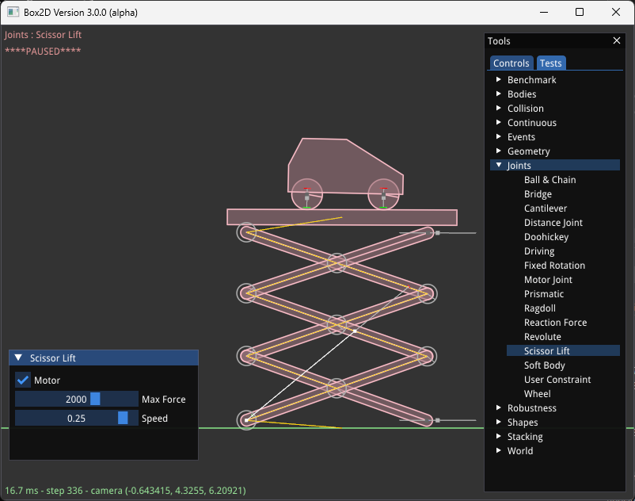

# Samples
Once you have conquered the HelloWorld example, you should start looking
at Box2D's samples application. The samples application is a testing framework and demo
environment. Here are some of the features:
- Camera with pan and zoom
- Mouse picking of shapes attached to dynamic bodies
- Extensible set of samples
- GUI for selecting samples, parameter tuning, and debug drawing options
- Pause and single step simulation
- Multi-threading and performance data

The samples application has many examples of Box2D usage in the test cases and the
framework itself. I encourage you to explore and tinker with the samples
as you learn Box2D.

Note: the sample application is written using [GLFW](https://www.glfw.org),
[imgui](https://github.com/ocornut/imgui), and [enkiTS](https://github.com/dougbinks/enkiTS). The samples is not part of the Box2D library. The Box2D library is agnostic about rendering. As shown by the HelloWorld example, you don't need a renderer to use Box2D.
